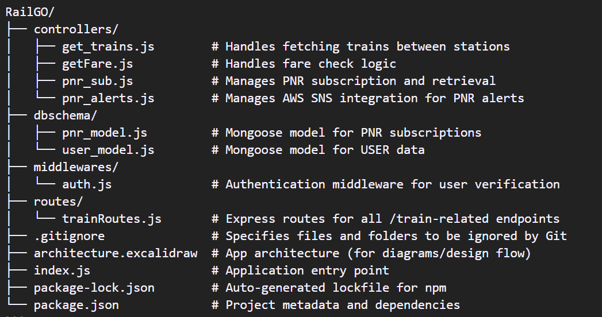

# RailGO

RailGO is a Node.js and Express-based backend application that allows users to:

- Search for trains between stations
- Check fares and seat availability
- Subscribe to PNR status tracking
- Receive alerts (via email/logs) if train status changes

## Table of Contents

- [Project Structure](#project-structure)
- [Endpoints](#endpoints)
  - [Train Routes](#train-routes)
    - [Search Trains](#search-trains)
    - [Check Fare](#check-fare)
    - [Subscribe PNR](#subscribe-pnr)
- [AWS SNS Integration](#aws-sns-integration)
- [Getting Started](#getting-started)
  - [Prerequisites](#prerequisites)
  - [Installation](#installation)
  - [Environment Variables](#environment-variables)
  - [Running the Application](#running-the-application)
- [License](#license)

## Project Structure



## Endpoints

### Train Routes

Base URL: `/api/v1/train`

#### Search Trains

- **Endpoint**: `/search`
- **Method**: GET
- **Query Parameters**:
  - `from`: Source station code (e.g., `NDLS`)
  - `to`: Destination station code (e.g., `BCT`)
- **Description**: Retrieves a list of trains operating between the specified stations.

#### Check Fare

- **Endpoint**: `/checkfare`
- **Method**: GET
- **Query Parameters**:
  - `trainNo`: Train number (e.g., `12951`)
  - `fromStationCode`: Source station code (e.g., `NDLS`)
  - `toStationCode`: Destination station code (e.g., `BCT`)
- **Description**: Fetches fare details for the specified train and route.

#### Subscribe PNR

- **Endpoint**: `/subscribe-pnr`
- **Method**: GET
- **Query Parameters**:
  - `pnrNumber`: PNR number to subscribe (e.g., `2810651211`)
- **Description**: Subscribes to PNR status tracking. Upon subscription, the system fetches PNR details and stores them in the database.

## AWS SNS Integration

The application integrates with AWS Simple Notification Service (SNS) to send email notifications upon PNR subscription. When a user subscribes to a PNR, the system sends an email with the PNR details to the user's registered email address.

**Note**: Ensure that the AWS credentials are set in the environment variables as described below.

## Getting Started

### Prerequisites

- Node.js (v14 or above)
- npm (Node Package Manager)
- MongoDB (for storing PNR subscriptions)
- AWS Account with SNS permissions (for email notifications)

### Installation

# 1. Clone the repository

`git clone https://github.com/prateekshukla17/RailGO.git`
`cd RailGO`

# 2. Install dependencies

`npm install`

# 3. Create a `.env` file in the root directory and add the following:

```
PORT=3000
JWT_SECRET=your_jwt_secret
xrapid_apikey=your_rapidapi_key
AWS_ACCESS_KEY_ID=your_aws_access_key
AWS_SECRET_ACCESS_KEY=your_aws_secret
AWS_REGION=your_preferred_region (e.g. ap-south-1)
```

# 4. Start the server

`node index.js`

## License

This project is open-source and available under the [MIT License](LICENSE).
